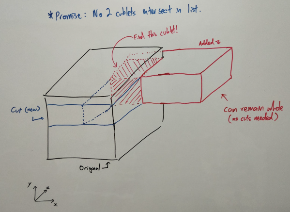

# Intersecting Cuboids

Solving part 1 by bruteforce, notice we need only record the 'ON' *cells*. Changing the definition of 'cell' paves the way to solving part 2.

## Insights

1. We need not record each coordinate within a cuboid, just the min(x,y,z) and max(x,y,z) is enough to define a 'cell'.
2. The intersection of two cuboids forms a cuboid described by the intersection of their 2d intervals along each axis.
3. We can avoid double-counting by taking a bite out of the existing cuboid when an intersection occurs.
4. The remaining shape can be described by at most 4 cuboids :)

With the above, some quick estimations should allow us to be confident that a brute force solution can work considering we have 420 cuboids (at worst O(16*N^2)).

## Illustration

As they say, a picture is worth a few thousand pixels:

